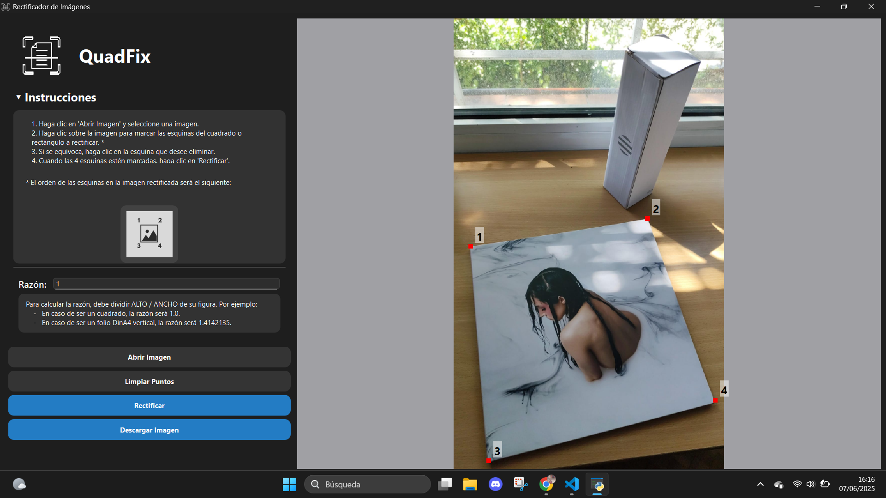
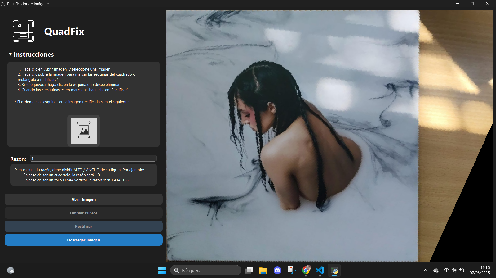

# QuadFix - Rectificador de imágenes con geometría proyectiva

## Descripción
QuadFix es una herramienta avanzada de procesamiento de imágenes desarrollada en Python que permite rectificar imágenes utilizando principios de geometría proyectiva. La aplicación está diseñada específicamente para corregir la distorsión en imágenes tomadas desde ángulos no frontales, transformándolas en vistas frontales precisas con las proporciones correctas.


## Características principales
- Interfaz gráfica intuitiva desarrollada con PySide6
- Corrección de perspectiva basada en geometría proyectiva
- Soporte para diferentes proporciones de aspecto (cuadrados, DIN A4, etc.)
- Detección automática de puntos de fuga
- Interpolación por vecino más cercano para la transformación de imagen
- Modo claro/oscuro integrado
- Visualización en tiempo real de los puntos de control

## Requisitos del sistema
- Python 3.12.3 o superior
- Sistema operativo: Linux, Windows, macOS

### Dependencias principales
- `opencv-python`
- `numpy`
- `PySide6`
- `pillow`
- `matplotlib`

## Instalación

1. Clonar el repositorio:
```bash
git clone [URL_del_repositorio]
```
2. Crear y activar un entorno virtual:

**En Linux/Mac:**
```bash
python -m venv venv 
source venv/bin/activate
```
**En Windows:**
```bash
python -m venv venv
venv\Scripts\activate
```

3. Instalar las dependencias:
```bash
pip install -r requirements.txt
```


## Uso

1. Ejecutar la aplicación:
```bash
python main.py
```

2. Funcionamiento básico:
   - Haga clic en "Abrir Imagen" para seleccionar una imagen
   - Marque las 4 esquinas del objeto a rectificar en el siguiente orden:
     ```
     1 --- 2
     |     |
     3 --- 4
     ```
   - Introduzca la razón de aspecto (altura/ancho) de su figura:
     - Para un cuadrado: 1.0
     - Para un folio DIN A4 vertical: 1.4142135
   - Haga clic en "Rectificar" para procesar la imagen





### Consejos de uso
- Si se equivoca al marcar un punto, puede hacer clic sobre él para eliminarlo
- La aplicación detectará automáticamente los puntos de fuga para una rectificación precisa
- Para mejores resultados, asegúrese de que el objeto a rectificar esté completamente visible en la imagen

## Fundamentos técnicos

QuadFix utiliza conceptos avanzados de geometría proyectiva para realizar la rectificación. Para una introducción más teórica, recomendamos leer la `Memoria.pdf`. Como resumen superficial, es necesario conocer:

1. **Homografías**: Transformaciones que preservan la linealidad y permiten corregir la perspectiva
2. **Puntos de fuga**: Utilizados para determinar la orientación original del objeto
3. **Preservación métrica**: Asegura que las proporciones del objeto se mantienen en la imagen rectificada

## Estructura del proyecto
```
image-rectification/
├── assets/                     # Recursos gráficos (logo, iconos, etc.)
├── classes/                    # Clases principales (modelo de puntos, coordenadas, etc.)
├── utils/                      # Módulos de utilidad
│   ├── dark_mode.py            # Gestión de modo claro/oscuro
│   ├── infinity_line.py        # Cálculo de puntos de fuga y líneas al infinito
│   └── projective_transform.py # Aplicación de homografía y transformaciones
├── widgets/                    # Componentes de la interfaz gráfica
│   ├── application.py          # Inicialización principal de la aplicación
│   ├── buttons.py              # Botones personalizados
│   ├── click_area.py           # Zona donde se marcan los puntos
│   └── menu.py                 # Menú superior y opciones
└── main.py                     # Punto de entrada de la aplicación
```

## Licencia
[Especificar la licencia]

## Contribuir
Las contribuciones son bienvenidas. Por favor, asegúrese de:
1. Hacer fork del repositorio
2. Crear una rama para su feature (`git checkout -b feature/AmazingFeature`)
3. Commit sus cambios (`git commit -m 'Add some AmazingFeature'`)
4. Push a la rama (`git push origin feature/AmazingFeature`)
5. Abrir un Pull Request

## Autores
**Autores**:  
Carmen Toribio Pérez, Marcos Carnerero Blanco y María Moronta Carrión  
**Dirección del proyecto**: Jonatan Sánchez Hernández
